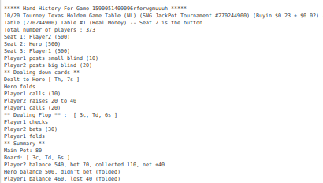
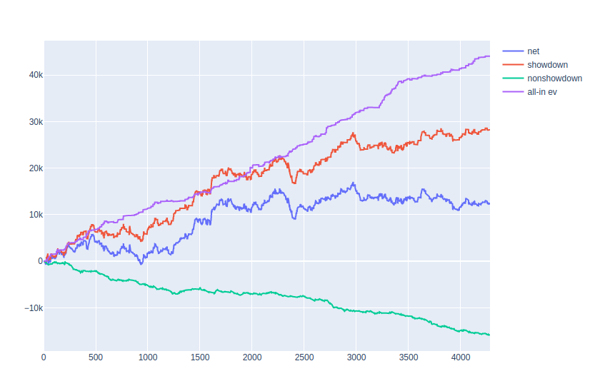

# handtracker
Hand history parser for party poker with cEV calculator and graphing

Takes poker site hand histories that look like this

	

and parses thousands of them into a database full of useful information so graphs like this can be created
	
